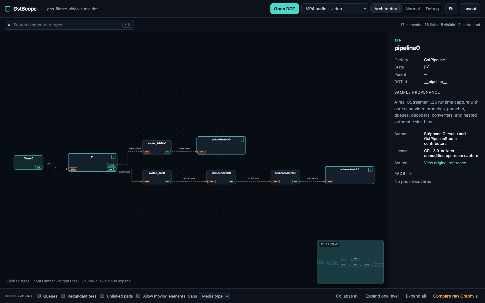

# GstScope

GstScope is a browser-only explorer for large GStreamer DOT pipeline dumps. It turns the authoritative DOT graph into a navigable semantic view with collapsible bins, pipeline-oriented simplification, caps inspection, search, and a raw Graphviz comparison.

## Try it

The latest successful build of `main` is published at **https://dheitmueller.github.io/gstscope/**.

DOT files selected with **Open DOT** or drag-and-drop stay in the browser. GstScope has no server-side runtime and does not upload pipeline data.



## Local development

GstScope requires Node.js 24 and npm 11 or newer.

```sh
git clone https://github.com/dheitmueller/gstscope.git
cd gstscope
npm ci
npm run dev
```

Then open <http://localhost:8080>.

Useful commands:

```sh
npm run build   # create the static site in dist/
npm run generate:samples # regenerate the documented sample fixtures
npm test        # verify orthogonal-routing geometry
npm run check   # tests, clean build, syntax check, and Pages-path validation
npm run dev     # build and serve locally
```

`dist/` and `node_modules/` are generated and intentionally excluded from source control.

## Features

- GStreamer-oriented parsing for pipelines, bins, elements, pads, links, states, properties, and negotiated caps.
- Architectural, Normal, and Debug projections derived from the complete imported graph.
- Collapsible hierarchy, queue and redundant-tee contraction, and optional unlinked-pad stubs.
- Off, media-type, and full caps-label modes.
- Element, bin, pad, and edge details in the inspector.
- Right-angle, right-to-left link geometry with separate ports for fan-in and fan-out.
- Direction-aware tracing: incoming links are amber, outgoing links are teal, and expanded-bin internals are violet.
- Pan, zoom, fit, re-layout, node dragging, and search.
- In-browser raw Graphviz comparison using the same DOT source.
- Twelve GPL-compatible, attributed sample pipelines, including two bin-rich
  expansion examples plus RTP, compositor, tee, playback, and stress topologies.

## Architecture

The application is static HTML, CSS, and JavaScript. Node.js is used only at build time to assemble browser bundles from locked npm dependencies.

`src/app.js` has three main stages:

1. `parseDot()` builds the complete GStreamer semantic model and retains raw attributes.
2. `projectGraph()` derives the visible graph from hierarchy and simplification options.
3. Cytoscape.js and Dagre lay out and render the projection.

All asset URLs are relative, so the same build works at the GitHub Pages project path, a custom-domain root, or a local web server. There is no client-side router and no backend requirement.

## Continuous integration and deployment

Pull requests and pushes to `main` run a clean locked install followed by `npm run check`. A separate Pages workflow deploys `dist/` only after the build and validation succeed. Generated output is uploaded as a Pages artifact; it is not committed to the repository.

## Sample provenance

The sample menu contains eleven compact DOT fixtures generated by this project from
pipelines documented by the GStreamer Project, plus GstScope's synthetic stress
graph. Each sample's author, source reference, license, and description appear in
the inspector when it is selected. The generated fixtures are part of GstScope and
are licensed GPL-2.0-or-later; they do not copy third-party DOT dumps.

Any future third-party DOT samples will be stored byte-for-byte as received; their
license and attribution metadata will live in the catalog rather than being added
to or rewritten inside the sample.

The catalog and exact source references are maintained in
[`src/sample-catalog.js`](src/sample-catalog.js). Run `npm run generate:samples`
after changing a fixture specification.

## Known limitations

- The importer is a pragmatic GStreamer-specific parser rather than a complete DOT grammar.
- Factory recovery depends on conventional GStreamer cluster labels.
- Simplification may coalesce parallel links between the same visible endpoints; the inspector retains the underlying link count.
- Manual positions last only for the current browser session.
- Live pipeline updates, telemetry, and editing are out of scope.

## License

GstScope is licensed under the GNU General Public License, version 2 or (at your option) any later version. See [LICENSE](LICENSE). Third-party notices are listed in [THIRD_PARTY_NOTICES.md](THIRD_PARTY_NOTICES.md).
